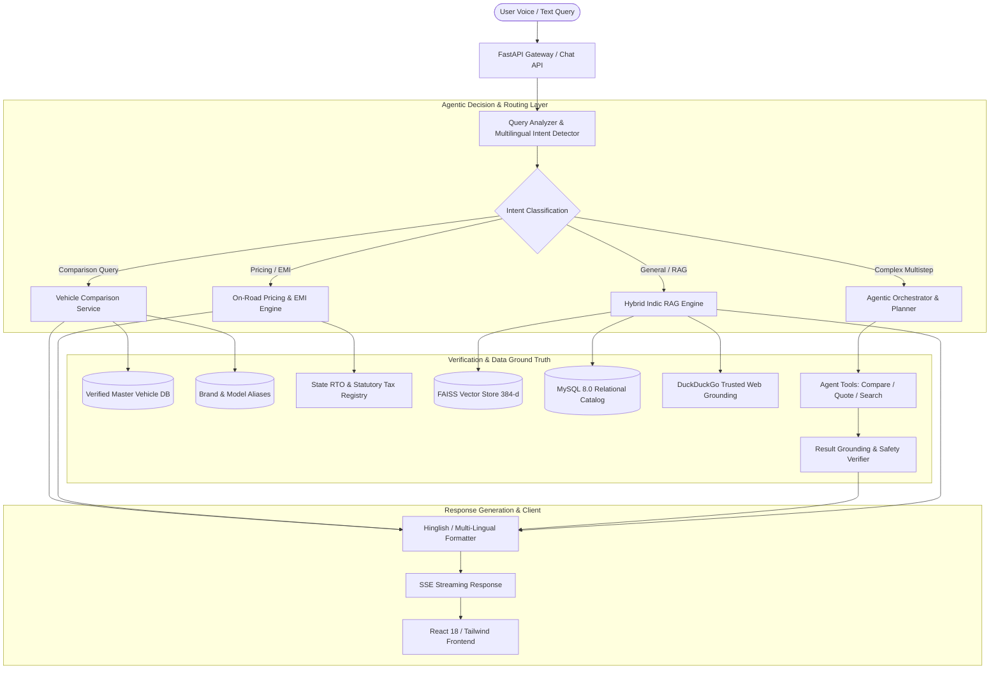

# 🏎️ AutoMind AI — Enterprise Automotive Intelligence & Research Platform

[](https://www.python.org/)
[](https://fastapi.tiangolo.com/)
[](https://reactjs.org/)
[](https://www.typescriptlang.org/)
[](https://www.docker.com/)
[](https://www.mysql.com/)
[-brightgreen.svg?style=flat&logo=pytest&logoColor=white)](https://pytest.org/)
[](LICENSE)

**AutoMind AI** is an enterprise-grade, agentic automotive intelligence and conversational research platform designed for the Indian and global automobile ecosystems. Combining a fine-tuned multilingual LLM layer, a deterministic Hybrid RAG engine, an autonomous Agentic Planner-Verifier architecture, and statutory on-road pricing & loan EMI calculation engines, AutoMind AI provides verifiable, hallucination-free automotive consultation in **English, Hindi, Hinglish, and Gujarati**.

---

## 📑 Table of Contents

- [Core Value Proposition](#-core-value-proposition)
- [System Architecture](#-system-architecture)
- [Key Platform Capabilities](#-key-platform-capabilities)
- [Tech Stack](#-tech-stack)
- [Directory Structure](#-directory-structure)
- [Quick Start Guide](#-quick-start-guide)
  - [Docker Desktop Deployment (Recommended)](#1-docker-desktop-deployment-recommended)
  - [Local Development Setup](#2-local-development-setup)
- [REST API Reference](#-rest-api-reference)
- [Testing & Quality Assurance](#-testing--quality-assurance)
- [License & Contributions](#-license--contributions)

---

## 💎 Core Value Proposition

Traditional automotive LLMs frequently suffer from three critical shortcomings:
1. **Hallucination of Specifications:** Inventing non-existent car models, placeholder engineering terms, or fake pricing.
2. **Context-Free Comparisons:** Treating conversational filler words (e.g., *"mujhe"*, *"ki comparison kro"*) as vehicle names, yielding fabricated comparisons like *"Muje Rolls Royals"*.
3. **Statutory Calculation Inaccuracy:** Miscalculating state-specific RTO taxes (cess, EV waivers, luxury slabs) and reducing-balance loan EMIs.

**AutoMind AI solves this with four interlocking architectural pillars:**
- **Zero-Hallucination Comparison Flow:** Extracts clean vehicle entities, validates them against canonical automotive catalogs, clarifies brand-only requests with model menus (e.g., Rolls-Royce ➔ Ghost, Cullinan, Phantom, Spectre), and rejects unverified models.
- **Deterministic Mathematical Pricing:** Eliminates LLM math hallucination by delegating RTO, TCS, insurance, and EMI computation to a dedicated Python statutory pricing engine.
- **Hybrid Indic RAG:** Integrates dense FAISS vector embeddings, structured SQL filtering, and live web grounding with reciprocal rank fusion (RRF) and cited sources.
- **Autonomous Multi-Step Agentic Layer:** Employs a planner-execution-verifier loop to dynamically decompose complex user queries into discrete tool calls.

---

## 🏛️ System Architecture



---

## 🌟 Key Platform Capabilities

- **🤖 Autonomous Agentic AI:** Multi-step planner and orchestrator with specialized tools (`compare_vehicles`, `calculate_pricing`, `search_knowledge`) and pre-execution validation.
- **⚖️ Verified Vehicle Comparison:** Multi-lingual intent detection (English, Hindi, Hinglish, Gujarati) with clean filler removal, brand disambiguation (Rolls-Royce ➔ Ghost, Cullinan, Phantom, Spectre), and zero-hallucination Markdown tables.
- **🧠 Hybrid Indic RAG Engine:** Dense FAISS semantic search (384-d) combined with SQL filters, OEM document ingestion (PDF, CSV, JSON), and trusted web citations (CarWale, Autocar).
- **💰 Statutory On-Road & EMI Engine:** State-accurate RTO tax calculations (GJ, MH, DL, KA), statutory cess, insurance, and reducing-balance multi-tenure (3/5/7 yr) loan EMI matrices.
- **🎙️ Speech Recognition & Personalized Memory:** Realtime browser voice input (English, Hindi, Gujarati) with persistent user name memory.
- **⚡ Preference DPO & 4-Bit Edge Quantization:** Thumbs Up/Down feedback collection with automated PII redaction and 67% VRAM reduction via 4-bit quantization (GGUF/NF4).

---

## 🛠️ Tech Stack

| Layer | Technologies |
| :--- | :--- |
| **Frontend UI** | React 18, TypeScript, Vite, Tailwind CSS, Framer Motion, Lucide Icons, React Router v6 |
| **Backend API** | Python 3.11+, FastAPI, Pydantic v2, SSE-Starlette (Streaming) |
| **Database & ORM** | MySQL 8.0, SQLAlchemy 2.0, Alembic, PyMySQL |
| **Vector Search & ML** | FAISS (`IndexFlatIP`), Sentence-Transformers (`all-MiniLM-L6-v2`), NumPy |
| **Agentic Framework** | In-house Deterministic Multi-Step Orchestrator, Typed Tools, Grounding Verifier |
| **Containerization** | Docker, Docker Compose (Multi-container networked setup) |
| **Testing** | Pytest, FastAPI TestClient, AnyIO, Unittest Mock (105 Tests Passing) |

---

## 📂 Directory Structure

```text
Project-V/
├── backend/
│   ├── app/
│   │   ├── api/v1/                   # FastAPI routes (auth, cars, chat, voice, pricing, feedback)
│   │   ├── core/                     # JWT security, settings, logging configuration
│   │   ├── db/                       # SQLAlchemy database session & model metadata
│   │   ├── models/                   # Relational models (User, Car, Conversation, IngestionJob)
│   │   ├── schemas/                  # Pydantic request/response schemas
│   │   ├── services/
│   │   │   ├── agentic/              # Multi-step orchestrator, planner, verifier & tools
│   │   │   ├── ai/                   # Comparison service, hybrid RAG, vector store, embeddings
│   │   │   ├── pricing/              # State RTO tax rules, insurance, fees, reducing-balance EMI
│   │   │   └── vehicle_search/       # Entity validators, domain whitelists, filters
│   ├── scripts/                      # DB seeding, CSV import, document ingestion scripts
│   ├── tests/                        # 105 automated unit and end-to-end pytest cases
│   └── requirements.txt              # Python production dependencies
├── frontend/
│   ├── src/
│   │   ├── api/                      # Axios client and API integration hooks
│   │   ├── components/               # UI components, chat interfaces, vehicle media cards
│   │   ├── context/                  # AuthContext and state providers
│   │   ├── pages/                    # Chat, Compare, Dashboard, Login, SavedCars pages
│   │   └── types/                    # TypeScript data definitions
│   ├── package.json
│   ├── vite.config.ts
│   └── tailwind.config.js
├── docker-compose.yml                # Orchestrates backend, frontend, and MySQL containers
├── Dockerfile.backend                # Container specification for FastAPI service
├── Dockerfile.frontend               # Container specification for React/Vite service
└── README.md
```

---

## 🚀 Quick Start Guide

### 1. Docker Deployment (Recommended)

#### Local Development (`compose.dev.yml`)
Includes volume mounts, live hot-reloading, and dev services:
```bash
# 1. Clone repository
git clone https://github.com/VedGoyaniTech/AutoMind-Ai.git
cd AutoMind-Ai

# 2. Configure environment variables
cp .env.example .env

# 3. Build and launch development containers
docker compose -f compose.dev.yml up -d --build
```

**Service Endpoints:**
- 🌐 **Frontend Application:** [http://localhost:5173](http://localhost:5173)
- ⚙️ **Backend REST API:** [http://localhost:8000](http://localhost:8000)
- 📖 **Interactive Swagger UI:** [http://localhost:8000/docs](http://localhost:8000/docs)
- 🗄️ **MySQL Database:** `localhost:3307` (user: `automind_user`, db: `automind_db`)

#### Hardened Production Deployment (`compose.prod.yml`)
Hardened topology with dedicated migration init container, unprivileged backend worker, Nginx reverse proxy with SSE-safe configuration, and internal private MySQL:
```bash
docker compose -f compose.prod.yml up -d --build
```

---

### 2. Local Development Setup (Native)

#### Backend Setup:
```bash
cd backend
python3.11 -m venv venv
source venv/bin/activate       # Linux / macOS (or venv\Scripts\activate on Windows)

# Core dependencies
pip install -r requirements.txt

# Run configuration pre-flight validation
python scripts/validate_config.py

# Execute database migrations
alembic upgrade head

# Start FastAPI development server
uvicorn app.main:app --reload --host 0.0.0.0 --port 8000
```

#### Frontend Setup:
```bash
cd frontend
npm ci
npm run dev
```

---

## 📡 REST API Reference

### 1. Conversational Chat & Streaming
- `POST /api/v1/chat/message`: Send automotive query, returns assistant response.
- `POST /api/v1/chat/stream`: Realtime Server-Sent Events (SSE) streaming endpoint.
- `POST /api/v1/chat/voice/transcribe`: Audio transcription with automotive intent extraction.

### 2. Statutory Pricing & EMI
- `POST /api/v1/pricing/quote`: Comprehensive on-road quote + multi-tenure (3/5/7 yr) EMI breakdown.
  ```json
  {
    "city": "Ahmedabad",
    "stateCode": "GJ",
    "model": "Creta",
    "exShowroomPrice": 1860000.0,
    "loanTenureYears": 5,
    "interestRate": 9.5
  }
  ```
- `POST /api/v1/pricing/on-road`: Itemized state RTO, road safety cess, FASTag, and insurance breakdown.
- `POST /api/v1/pricing/emi`: Standalone reducing-balance loan calculator.

### 3. User Feedback & Preference Learning
- `POST /api/v1/chat/feedback`: Submit Thumbs Up / Down with granular reason codes.
- `GET /api/v1/chat/feedback/status`: Check feedback submission state for a message.

---

## 🧪 Testing & Quality Assurance

AutoMind AI enforces strict test-driven quality assurance. Every commit is validated with **105 automated unit and end-to-end test cases**:

```bash
# Run entire backend test suite inside Docker
docker exec automind_backend pytest /app/tests/ -v

# Run vehicle comparison flow test suite
docker exec automind_backend pytest /app/tests/test_comparison_flow.py -v

# Run agentic workflow test suite
docker exec automind_backend pytest /app/tests/test_agentic_workflows.py -v
```

### Verified Test Matrix:
- ✅ **Comparison Flow (12 Tests):** Case A–F validation, multi-lingual intent (English, Hindi, Hinglish, Gujarati), clean candidate extraction, developer trace logging.
- ✅ **Agentic Workflows (29 Tests):** Multi-step planning, tool invocations, TCO calculations, verification safety gates.
- ✅ **Pricing & RTO Calculations (18 Tests):** State RTO slabs (GJ, MH, DL, KA), EV exemptions, zero-interest safety, reducing-balance math.
- ✅ **Hybrid RAG & Vector Search (8 Tests):** Exact filter retrieval, semantic chunking, deduplication, citation grounding.
- ✅ **Historical Automotive Knowledge (20 Tests):** Multi-era car queries (2000–2026), classic Indian launches, honest no-data disclosures.

---

## 🛡️ License & Security
- **Security Policy & Secret Rotation:** See [docs/SECURITY.md](docs/SECURITY.md) for vulnerability reporting and rotation guidance (`openssl rand -hex 32`).
- **Production Hardening:** Fails fast on default keys or wildcard CORS with credentials via startup validation.
- **Health Probes:** Liveness (`/api/v1/health/live`) and DB readiness (`/api/v1/health/ready` with 503 handling).
- **Authentication:** Strict JWT token enforcement (zero demo bypasses, integer ID validation, 401 on malformed/expired/inactive tokens).
- **Data Protection:** Parameterized SQL queries via SQLAlchemy ORM; automated PII redaction on DPO exports.
- **License:** Released under the [MIT License](LICENSE). Built for developers, researchers, and automobile enthusiasts.

